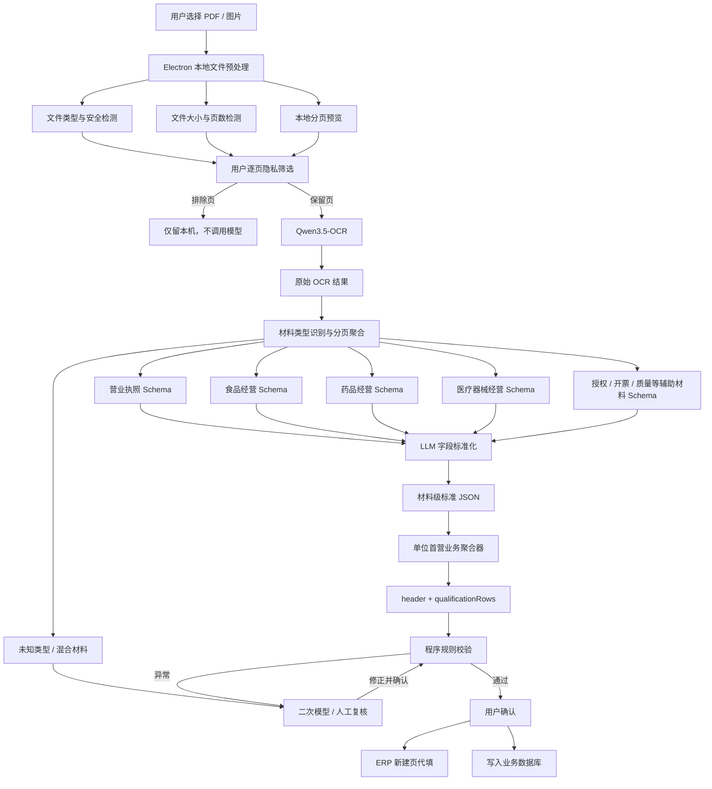

# OCR 许可证与单位首营资料智能处理架构说明

## 1. 文档目的

本文描述许可证与单位首营资料 OCR 处理系统的目标架构。系统接收用户上传的 PDF 或图片，对文件进行安全与质量检查，调用 OCR 模型提取原始内容，识别材料类型，再按照对应 Schema 使用大语言模型完成字段标准化。各材料的标准化结果进一步聚合成 ERP“单位首营审批”所需的 `header + qualificationRows` 业务 JSON。业务 JSON 必须经过程序规则校验，校验通过并经用户确认后，才能用于 ERP 代填或写入数据库；异常结果进入二次识别或人工复核流程。

本文中的 `Qwen3.5-OCR` 和 `DeepSeek-v4-flash-0731` 是当前配置的模型，不应在业务流程中形成不可替换的依赖。模型、提示词和 Schema 均应支持独立版本管理与替换。

本架构的业务字段依据如下：

- [`config/erp/unit-initial-approval.fields.json`](../config/erp/unit-initial-approval.fields.json) 是字段名称、ERP 定位器、类型、来源和归一化规则的事实来源。
- [`test-data/unit-initial-approval.example.json`](../test-data/unit-initial-approval.example.json) 是脱敏的输出结构与联调示例。
- 架构文档、后端数据模型、LLM 输出 Schema 和前端 ERP 映射必须使用同一个 `schemaVersion`，避免字段逐步漂移。

### 1.1 当前客户端落地方式

当前版本采用“Electron 本地预处理 + Pi Agent 模型编排”的无自建业务后台方案：

1. Electron 主进程负责文件类型、大小和页数检查。
2. PDF 使用 `pdfjs-dist + @napi-rs/canvas` 在本机生成可放大的逐页预览；图片也只在本机解码和预览。
3. 用户在模型调用前排除身份证、护照、银行卡、人脸证件照等高敏页；排除页不会发送给任何模型。
4. 只有用户保留的页面才在本机缩放为 OCR JPEG，并通过 `@earendil-works/pi-ai` 调用 Qwen OCR。
5. 使用受控并发的页面流水线；每页使用隔离的 `@earendil-works/pi-agent-core` Agent 完成 OCR 后，立即调用字段标准化模型并合并结果。
6. Agent 只暴露 `submit_unit_initial_approval`，其参数直接受单位首营 TypeBox Schema 约束；不向 Agent 提供 Shell、任意文件写入、数据库写入、浏览器控制或 ERP 保存工具。
7. 工具结果继续经过 TypeScript 确定性规则校验，并在用户点击“开始识别”后增量代填当前 ERP 新建页；全部用户保留页处理完成后结束。客户端不会自动保存或提交。

这里的“无后台”仅表示不维护本项目自己的 OCR Web 服务。用户排除页始终留在本机；用户保留页在使用云端 Qwen OCR 和字段标准化接口时仍会离开本机。涉及受监管资料时，除人工逐页过滤外，还应确认数据驻留、日志保留与供应商合规要求；若任何页面都不能离开内网，应改用内网模型或完整本地链路。

当前实现与目标架构还有两点边界：

- 模型接口未提供字符坐标和字符级置信度时，客户端只能保留逐页原文，相关置信度显示为不可用；不能伪造模型未返回的坐标或分数。
- 当前结果仅暂存在 Electron 进程内存中并用于用户确认后的 ERP 代填，尚未实现数据库持久化、任务审计和人工复核工作台。

## 2. 建设目标

- 支持 PDF、PNG、JPEG、TIFF 等常见文件格式。
- 支持一个文件包含多页、多个许可证或其他附件。
- 支持营业执照、食品经营、药品经营、医疗器械经营等证照，以及授权书、开票资料、质量评审等辅助材料。
- 将非结构化 OCR 内容转换为统一、可校验的 JSON。
- 输出与现有 `unit-initial-approval.fields.json` 一致的单位首营审批字段。
- 所有自动提取字段都能追溯到原始页码、原文和区域。
- 对模型输出执行确定性校验，防止未经核验的数据直接入库。
- 对低置信度、字段冲突和证照遮挡提供二次识别与人工复核机制。
- 保留完整的模型版本、提示词版本、Schema 版本和操作审计记录。

## 3. 总体架构



核心原则是：

> OCR 负责“看见内容”，类型识别负责“选择材料 Schema”，LLM 负责“理解和归一化”，业务聚合器负责“组装 ERP 字段”，程序规则负责“判断结果能否进入业务系统”。

## 4. 处理流程

### 4.1 文件选择与隐私筛选

当前 Electron 客户端选择文件后，先在本机生成逐页缩略图，并要求用户确认哪些页面可以发送给模型。原始文件路径只保存在主进程，renderer 仅获得缩略图和一次性令牌；用户排除页不会进入 OCR 请求或后续字段标准化上下文。

未来增加服务端任务系统时，应在上传前保留同等隐私门禁，并只上传用户允许处理的页级资产。服务端随后创建异步任务并返回任务 ID，后续 OCR、模型调用和人工复核围绕该任务执行。

建议记录以下上传信息：

- 原始文件名、文件大小、MIME 类型和文件哈希。
- 上传用户、所属组织和上传时间。
- 业务场景，例如“单位首营审批”。
- 幂等键，避免同一文件被重复处理和重复入库。

### 4.2 文件预处理服务

文件预处理服务负责在调用模型前建立可靠、统一的输入。

主要职责：

1. 校验文件扩展名、MIME 类型和文件头是否一致。
2. 校验文件大小、PDF 页数、图片尺寸和最大像素数。
3. 检测 PDF 是否加密、损坏或无法渲染。
4. 将 PDF 拆分为可独立处理和重试的页面。
5. 检测页面方向、清晰度、倾斜、低对比度和空白页。
6. 根据需要执行旋转、裁边、去噪、增强或分辨率调整。
7. 生成文件清单 `DocumentManifest`，供后续阶段使用。

示例输出：

```json
{
  "documentId": "doc_01",
  "sha256": "...",
  "pageCount": 12,
  "pages": [
    {
      "pageNumber": 1,
      "assetId": "page_01",
      "width": 2480,
      "height": 3508,
      "rotation": 0,
      "qualityScore": 0.91
    }
  ],
  "warnings": []
}
```

### 4.3 OCR 识别

预处理后的页面提交给 `Qwen3.5-OCR`。OCR 层只负责还原页面内容和空间信息，不直接决定最终业务字段。

原始 OCR 结果至少应包含：

- 页码和页面尺寸。
- 识别文本或 Markdown。
- 文本块、表格、印章等区域坐标。
- 文本块置信度。
- 原始图片或可回溯的页面资源 ID。
- OCR 模型名称、模型版本和处理时间。

原始 OCR 结果需要单独保存。后续字段标准化失败或业务规则变化时，可以直接重新解析，无需再次执行成本较高的 OCR。

### 4.4 材料类型识别与分页聚合

为满足单位首营审批字段，分类对象必须从“许可证类型”扩展为“材料类型”。系统不应只给整个 PDF 指定一个类型，而应先按页识别，再将连续且语义相关的页面归为同一份材料。

第一阶段至少支持以下 `documentType`：

| documentType | 材料 | 主要产出 |
| --- | --- | --- |
| `business_license` | 营业执照 | 企业名称、统一社会信用代码、法定代表人、注册地址、营业执照证照行 |
| `drug_business_license` | 药品经营许可证 | 单位类型、经营范围、仓库地址、质量负责人、药品许可证证照行 |
| `food_business_license` | 食品经营许可证或预包装食品备案 | 食品证照行及食品经营信息 |
| `medical_device_license` | 医疗器械经营许可或备案 | 器械证照行及器械经营范围 |
| `authorization_letter` | 采购、提货或收货授权书 | 采购员、自提人、收货人及身份证号、电话、地址 |
| `invoice_profile` | 开票资料、银行资料 | 开户名称、开户银行、账号、税号、开票电话和发票类型 |
| `quality_assessment` | 质量体系调查或实地考察资料 | 企业负责人、质量负责人、单位电话、调查结论候选值 |
| `identity_document` | 身份证或其他个人证件 | 授权人员姓名和证件号码的交叉核验依据 |
| `other` | 其他附件 | 保留 OCR，不自动映射业务字段 |

建议输出：

```json
{
  "documents": [
    {
      "documentType": "drug_business_license",
      "pageNumbers": [1, 2],
      "confidence": 0.98,
      "evidence": ["药品经营许可证", "经营范围"]
    },
    {
      "documentType": "medical_device_license",
      "pageNumbers": [3],
      "confidence": 0.94,
      "evidence": ["第二类医疗器械经营备案凭证"]
    }
  ]
}
```

材料类型识别可以采用关键词规则和分类模型组合：

- 规则负责高精度命中许可证标题、证号前缀和固定版式。
- 模型负责处理标题缺失、拍摄残缺、旧版证照和混合材料。
- 规则与模型结果冲突时，不直接覆盖，应生成待复核问题。
- 同一材料允许跨多页，身份证页可以与前一份授权书形成父子关系。
- 无法确认的材料统一标记为 `other`，不得强制套用某个业务 Schema。

## 5. Schema 与 ERP 字段设计

### 5.1 Schema 分层

结合现有 [`config/erp/unit-initial-approval.fields.json`](../config/erp/unit-initial-approval.fields.json)，Schema 分为三层：

1. **材料级 Schema**：描述单份营业执照、许可证、授权书或开票资料的标准字段。
2. **业务聚合 Schema**：将多个材料结果合并为单位首营审批的 `header + qualificationRows`。
3. **ERP 映射 Schema**：记录 JSON Path、ERP 元素 ID、控件类型、枚举映射、是否可编辑及序列化方式。

现有字段定义包含 32 个头部字段和 7 个证照明细字段。其中 26 个头部字段已经验证 ERP 定位器，14 个头部字段属于建议重点提取字段，3 个字段属于敏感信息。

`requiredForExtraction` 表示 OCR 或人工录入阶段建议采集，不等同于 ERP 页面自身的必填规则。当前 `erpRequired` 仍为 `unknown`，后续需要通过页面属性、保存校验或接口响应确认；`locatorStatus: unverified` 的字段在验证真实 DOM 前不得自动填写。

### 5.2 最终业务输出

OCR 流程的最终业务输出必须遵循以下顶层结构：

```json
{
  "schemaVersion": "1.0.0",
  "header": {},
  "qualificationRows": [],
  "fieldEvidence": {},
  "validation": {
    "status": "passed",
    "issues": []
  },
  "reviewRequired": []
}
```

其中：

- `header` 对应 ERP“购货单位首营登记”的基本资料区域。
- `qualificationRows` 对应 ERP 下方可重复的证照资料网格。
- `fieldEvidence` 保存每个字段的页码、原文、坐标和置信度。
- `validation` 保存程序校验结论，不能由 LLM 自行给出最终通过状态。
- `reviewRequired` 保存印章遮挡、字段冲突或低置信度等人工核对事项。

### 5.3 重点提取的头部字段

以下 14 个字段在现有 JSON 中标记为 `requiredForExtraction: true`：

| JSON Key | ERP 元素 ID | 页面字段 | 主要来源 | 标准化要求 |
| --- | --- | --- | --- | --- |
| `unitName` | `DWMC` | 单位名称 | 营业执照、许可证 | 保留企业全称 |
| `companyBankName` | `GSKHYH` | 公司开户银行 | 开票或银行资料 | 去除异常空格，禁止猜测被印章遮挡内容 |
| `legalRepresentative` | `DWFDDBR` | 单位法定代表人 | 营业执照、质量资料 | 多材料结果应一致 |
| `companyTaxNo` | `GSKHSH` | 公司开户税号 | 开票资料、营业执照 | 通常为统一社会信用代码 |
| `businessLicenseNo` | `YYZZH` | 营业执照号 | 营业执照 | 校验统一社会信用代码格式与校验位 |
| `registeredAddress` | `ZCDZ` | 注册地址 | 营业执照、许可证 | 保留证照原始地址 |
| `companyAccountName` | `GSKHMC` | 公司开户名称 | 开票或银行资料 | 应与单位名称执行一致性校验 |
| `warehouseAddress` | `CKDZ` | 仓库地址 | 药品或器械许可证、质量资料 | 多个仓库时保留列表并按 ERP 规则序列化 |
| `companyBankAccount` | `GSKHZH` | 公司开户账号 | 开票或银行资料 | 敏感字段；仅接受有证据的识别值 |
| `unitPhone` | `DWDH` | 单位电话 | 质量资料、开票资料 | 支持固话和手机号 |
| `qualityResponsiblePerson` | `DWZLFZR` | 单位质量负责人 | 药品许可证、质量资料 | 与“企业负责人”分开提取 |
| `unitType` | `DWLX` | 单位类型 | 许可证类型和经营方式 | 映射为 ERP 下拉枚举 |
| `enterpriseResponsiblePerson` | `DWQYFZR` | 单位企业负责人 | 药品许可证、质量资料 | 不得与法定代表人自动混同 |
| `businessScope` | `JYFW` | 经营范围 | 药品、食品、器械许可证 | JSON 中为数组，填入 ERP 时用英文逗号连接 |

`unitType` 当前已知 ERP 选项为：`批发企业`、`零售连锁`、`零售企业`、`医疗机构`、`生产企业`。模型输出必须经过枚举映射，无法映射时转人工确认，不能直接向下拉框写入未知值。

### 5.4 其他头部字段

其余字段需要按来源和可编辑性区别处理：

| JSON Key | ERP 元素 ID | 页面字段 | 来源与处理方式 |
| --- | --- | --- | --- |
| `referenceYaoshibang` | 待验证 | 引用药师帮 | 用户在 ERP 中选择，OCR 不填写 |
| `referenceYaobang` | 待验证 | 引用药帮忙 | 用户在 ERP 中选择，OCR 不填写 |
| `unitCode` | 待验证 | 单位编码 | ERP 系统生成，只读 |
| `exists` | 待验证 | 存在 | ERP 系统判断，只读 |
| `buyerName` | `CGYXM` | 采购员姓名 | 采购授权书或用户确认 |
| `businessDivision` | 待验证 | 事业部 | 组织配置或用户选择 |
| `unitShortName` | 待验证 | 单位简称 | 可生成候选值，但必须由用户确认 |
| `buyerIdCardNo` | `CGYSFZ` | 采购员身份证号 | 授权书和身份证；敏感字段 |
| `companyInvoiceType` | `GSKPLX` | 公司开票类型 | 映射为 `专票` 或 `普票` |
| `selfPickupName` | `ZTRXM` | 自提人姓名 | 提货授权书和身份证 |
| `selfPickupIdCardNo` | `ZTRSFZH` | 自提人身份证号 | 提货授权书和身份证；敏感字段 |
| `siteInspectionStatus` | `SDKCQK` | 实地考察情况 | 人工调查结论，不建议由证照 OCR 自动生成 |
| `invoiceContactPhone` | `SPLXDH` | 税票联系电话 | 开票资料或用户确认 |
| `receivingPerson` | `SHRY` | 收货人员 | 收货授权书或用户确认 |
| `receivingPhone` | `SHDH` | 收货电话 | 收货授权书或用户确认 |
| `receivingAddress` | `SHDZ` | 收货地址 | 收货授权书或用户确认 |
| `earliestQualificationExpiryDate` | `ZZDQRQ` | 资质最早到期日期 | 从证照行非空 `expiryDate` 中取最早日期 |
| `qualificationExpiryReminder` | `ZZDQTX` | 资质到期提醒 | 任意证照启用到期控制时为“是” |

`buyerIdCardNo`、`selfPickupIdCardNo` 和 `companyBankAccount` 是当前 Schema 中明确标记的敏感字段。日志、监控和异常信息应只显示脱敏值。

### 5.5 证照明细表

`qualificationRows` 是可重复数组，每份需要进入 ERP 资料网格的证照生成一行：

| JSON Key | ERP 单元格 | 页面列 | 提取或生成规则 |
| --- | --- | --- | --- |
| `dataType` | `ZLLX` | 资料类型 | 来自材料分类结果 |
| `certificateNo` | `ZSBH` | 证书编号 | 许可证号、备案号或统一社会信用代码 |
| `issuingAuthority` | `FZJG` | 发证机关 | 发证机关、登记机关或备案部门 |
| `issueDate` | `FZRQ` | 发证日期 | 统一为 `YYYY-MM-DD` |
| `expiryDate` | `DQRQ` | 到期日期 | 无到期日或长期有效时为 `null` |
| `expiryControl` | `DQKZ` | 到期控制 | `expiryDate` 非空时建议为 `true` |
| `materialProvided` | `ZLTG` | 资料提供 | 默认 `true`，ERP 中序列化为“是” |

第一阶段至少支持以下 `dataType`：

- `营业执照`
- `药品经营许可证`
- `预包装食品保健食品备案`
- `第二类医疗器械经营备案凭证`

后续新增证照类型时，只扩展材料 Schema 和 `dataType` 字典，不改变 `qualificationRows` 的通用行结构。

### 5.6 材料级 Schema

所有证照类材料共享以下中间字段：`documentType`、`dataType`、`enterpriseName`、`certificateNo`、`issuingAuthority`、`issueDate`、`expiryDate`、`registeredAddress`、`warehouseAddresses`、`businessScopeRaw`、`businessScopeNormalized`、`sourcePages` 和 `fieldEvidence`。

各类材料在公共字段基础上增加专用字段：

| Schema | 专用字段 |
| --- | --- |
| 营业执照 | `unifiedSocialCreditCode`、`legalRepresentative`、`enterpriseType`、`establishedDate`、`registrationAuthority` |
| 药品经营许可证 | `operationMode`、`qualityResponsiblePerson`、`enterpriseResponsiblePerson`、`dailySupervisionAuthority`、`drugBusinessScopes` |
| 食品经营许可或备案 | `credentialKind`、`operatorType`、`businessFormat`、`foodBusinessItems`、`filingAuthority` |
| 医疗器械经营许可或备案 | `credentialKind`、`businessMode`、`medicalDeviceScopeCodes`、`medicalDeviceScopeText`、`filingDate` |
| 授权书 | `authorizationKind`、`principalName`、`authorizedPersonName`、`idCardNo`、`phone`、`address`、`validFrom`、`validTo` |
| 开票或银行资料 | `accountName`、`bankName`、`bankAccount`、`taxNo`、`invoiceType`、`invoicePhone` |
| 质量评审资料 | `enterpriseResponsiblePerson`、`qualityResponsiblePerson`、`contactPhone`、`assessmentText` |

材料级 Schema 的作用是保留原始语义，不直接等同于 ERP 字段。例如 `warehouseAddresses` 可以保留多个地址，业务聚合器再根据 ERP 控件能力决定如何写入 `warehouseAddress`；`businessScopeRaw` 必须保留证照原文，`businessScopeNormalized` 才用于 ERP 枚举或文本字段。

### 5.7 材料到业务字段的映射

| 材料类型 | 写入 header | 生成 qualificationRows |
| --- | --- | --- |
| 营业执照 | `unitName`、`businessLicenseNo`、`companyTaxNo`、`legalRepresentative`、`registeredAddress`、`companyAccountName` | 营业执照行 |
| 药品经营许可证 | `unitType`、`warehouseAddress`、`qualityResponsiblePerson`、`enterpriseResponsiblePerson`、`businessScope` | 药品经营许可证行 |
| 食品经营许可或备案 | 可补充 `unitName`、`registeredAddress`、食品经营范围 | 食品经营证照行 |
| 医疗器械经营许可或备案 | 可补充 `warehouseAddress`、器械经营范围 | 医疗器械证照行 |
| 采购授权书 | `buyerName`、`buyerIdCardNo` | 不生成证照行 |
| 提货或收货授权书 | `selfPickupName`、`selfPickupIdCardNo`、`receivingPerson`、`receivingPhone`、`receivingAddress` | 不生成证照行 |
| 开票或银行资料 | `companyBankName`、`companyBankAccount`、`companyAccountName`、`companyTaxNo`、`companyInvoiceType`、`invoiceContactPhone` | 不生成证照行 |
| 质量评审资料 | `unitPhone`、`qualityResponsiblePerson`、`enterpriseResponsiblePerson`；只生成 `siteInspectionStatus` 候选 | 不生成证照行 |

### 5.8 字段证据与冲突处理

每个自动提取字段都应附带证据：

```json
{
  "header.companyBankAccount": {
    "rawText": "银行账号：……",
    "pageNumber": 8,
    "boundingBox": [120, 350, 820, 410],
    "confidence": 0.82,
    "documentType": "invoice_profile",
    "reviewRequired": true
  }
}
```

同一字段可能来自多份材料。聚合器应保留候选值并按照“权威材料优先、证据完整优先、置信度优先”的策略选择；多个高可信候选不一致时必须生成冲突问题，禁止静默覆盖。

未在原文中发现的字段必须返回 `null` 或空数组，禁止模型根据常识补全。系统字段、用户选择字段和人工调查结论不能因模型“推测出值”而被自动填写。

### 5.9 标准化输出示例

```json
{
  "header": {
    "unitName": "示例医药有限公司",
    "businessLicenseNo": "91220000EXAMPLE001",
    "companyTaxNo": "91220000EXAMPLE001",
    "registeredAddress": "吉林省长春市示例路100号",
    "warehouseAddress": "吉林省长春市示例路200号",
    "unitType": "批发企业",
    "businessScope": ["中成药", "化学药制剂"],
    "earliestQualificationExpiryDate": "2029-01-01",
    "qualificationExpiryReminder": "是"
  },
  "qualificationRows": [
    {
      "dataType": "药品经营许可证",
      "certificateNo": "吉AA0000000",
      "issuingAuthority": "示例药品监督管理局",
      "issueDate": "2024-01-01",
      "expiryDate": "2029-01-01",
      "expiryControl": true,
      "materialProvided": true
    }
  ]
}
```

## 6. LLM 字段标准化

### 6.1 材料级标准化

材料类型确定后，将以下内容一并提交给字段标准化模型：

- 对应许可证的原始 OCR 文本。
- 相关页码和文本块坐标。
- 当前材料类型的 JSON Schema。
- 该材料允许写入的单位首营字段白名单。
- 字段来源限制，例如实地考察结论不得从营业执照推测。
- 枚举字典、日期格式和字段归一化规则。
- 明确的“不得猜测、缺失返回 null”约束。

字段标准化模型当前配置为支持 Function Calling 的 `DeepSeek-v4-flash-0731`。该模型不依赖原生结构化输出，而是调用参数受 TypeBox Schema 约束的 `submit_unit_initial_approval` 工具提交结果；禁止只返回解释性文字或 Markdown。

标准化规则包括：

- 日期统一为 `YYYY-MM-DD`。
- 证号移除多余空格，但保留字母大小写和有效符号。
- 企业名称保留原文，同时可额外生成去除异常空格的标准值。
- 地址保留原始地址，行政区划标准化结果作为独立字段保存。
- 经营范围映射为标准枚举，同时保留原始文本。
- OCR 无法确认的字符不得擅自修复，应降低置信度并加入复核列表。

### 6.2 单位首营业务聚合

材料级 JSON 完成后，由程序化聚合器生成 `header + qualificationRows`。聚合器应尽量使用确定性映射，不建议再次让 LLM 自由生成整个 ERP Payload。

聚合阶段负责：

- 按第 5.7 节的映射表将材料字段写入 `header`。
- 为营业执照和各类许可证生成证照明细行。
- 保留同一字段的全部候选值及证据。
- 计算 `earliestQualificationExpiryDate`。
- 根据证照行计算 `qualificationExpiryReminder` 和 `expiryControl`。
- 将 `businessScope` 保持为数组，直到 ERP 适配层再序列化。
- 不写入系统只读、用户选择或未经确认的人工调查字段。

## 7. 程序规则校验

LLM 输出不能直接入库，必须依次通过以下确定性检查。

### 7.1 结构校验

- JSON 是否可解析。
- 顶层是否包含 `header` 和 `qualificationRows`。
- 材料级 `documentType` 是否与所选 Schema 一致。
- 必填字段、字段类型、枚举值和数组结构是否正确。
- 是否出现 Schema 未允许的额外字段。
- 业务字段是否全部存在于 `unit-initial-approval.fields.json` 白名单中。
- 证照行是否只包含 7 个规定字段。

### 7.2 格式校验

- 统一社会信用代码长度、字符集和校验位。
- 许可证编号是否符合对应许可证的规则或允许的历史格式。
- 日期是否为有效日期。
- 电话、身份证号、银行账号等敏感字段是否满足格式要求。
- `unitType` 是否属于 ERP 实际下拉选项。
- `companyInvoiceType` 是否已归一化为 `专票` 或 `普票`。
- `businessScope` 是否为字符串数组，且不存在空项目。

### 7.3 业务校验

- `validFrom` 不得晚于 `validTo`。
- 发证日期不得明显晚于当前处理时间。
- 企业名称和统一社会信用代码在多份证照中应保持一致。
- `companyTaxNo` 与 `businessLicenseNo` 不一致时必须提示复核。
- `companyAccountName` 与 `unitName` 不一致时必须提示复核。
- 授权书姓名、身份证姓名和身份证号的对应关系必须一致。
- `qualificationRows[*].expiryControl` 应与 `expiryDate` 是否存在相符。
- `earliestQualificationExpiryDate` 必须等于所有非空证照到期日的最小值。
- `qualificationExpiryReminder` 必须由证照到期控制规则计算，不能采用 LLM 自由输出。
- OCR 原文必须能找到关键字段的证据，不能只有模型输出值。
- 同一字段存在多个冲突值时必须转人工确认。
- 已过期或即将到期的许可证需要生成业务告警。

校验结果分为：

- `passed`：可以自动进入待确认或入库流程。
- `warning`：数据可用，但必须向用户展示风险。
- `failed`：禁止入库，进入二次处理或人工复核。

## 8. 异常处理与复核闭环

异常处理建议按成本从低到高执行：

1. 对失败页面重新执行方向纠正、裁剪、分辨率提升或图像增强。
2. 只对失败字段的局部区域进行二次 OCR。
3. 使用更高精度模型或调整后的结构化提示词重试。
4. 对多次结果执行一致性比较，不能仅采用最后一次结果。
5. 超过最大重试次数后进入人工复核。

人工复核界面应同时展示：

- 原始页面及字段区域高亮。
- 原始 OCR 文本。
- 模型标准化结果。
- 程序校验错误或冲突原因。
- 历次模型输出和置信度。
- 修改、确认、退回和作废操作。

人工修改必须记录修改前值、修改后值、操作人和时间，并作为后续评估模型效果的数据来源。

## 9. 数据存储建议

建议将原始文件、过程数据和最终业务数据分层存储：

| 数据对象 | 主要内容 | 建议保存位置 |
| --- | --- | --- |
| `document` | 文件元数据、哈希、任务状态 | 关系数据库 |
| `document_asset` | 原始 PDF、分页图片、局部裁剪 | 对象存储 |
| `ocr_result` | 原始 OCR、坐标、置信度、模型版本 | JSON/文档存储或关系数据库 JSON 字段 |
| `material_result` | 每份证照、授权书或开票资料的标准化结果 | 关系数据库 JSON 字段或文档存储 |
| `unit_initial_approval` | 聚合后的单位首营 `header` | 关系数据库 |
| `qualification_record` | 对应 `qualificationRows` 的证照明细 | 关系数据库 |
| `validation_issue` | 错误、警告、复核状态 | 关系数据库 |
| `audit_event` | 模型调用、人工修改、入库操作 | 只追加审计表 |

真实许可证可能包含身份证号、联系方式、银行账号等敏感信息。调用外部模型前必须先经过本地逐页人工筛选；同时应配置访问控制、传输加密、静态加密、日志脱敏和数据保留周期。业务日志不得直接打印完整 OCR 内容或完整敏感字段。

## 10. 任务状态设计

建议采用以下状态：

```text
uploaded
  → preprocessing
  → ocr_processing
  → classifying
  → standardizing
  → aggregating
  → validating
  → passed
      └→ awaiting_confirmation
          ├→ erp_filled
          └→ persisted
  → review_required
      └→ validating
  → failed
```

每个阶段都应记录开始时间、结束时间、执行版本、重试次数和失败原因。任务重试应从失败阶段继续，避免重复执行已经成功且结果可复用的阶段。

## 11. 建议 API

| 方法 | 路径 | 说明 |
| --- | --- | --- |
| `POST` | `/api/v1/documents` | 上传文件并创建处理任务 |
| `GET` | `/api/v1/documents/{id}` | 查询文件、任务状态和当前进度 |
| `GET` | `/api/v1/documents/{id}/ocr` | 获取原始 OCR 结果 |
| `GET` | `/api/v1/documents/{id}/materials` | 获取分类后的材料级结构化结果 |
| `GET` | `/api/v1/documents/{id}/unit-initial-approval` | 获取聚合后的 `header + qualificationRows` |
| `POST` | `/api/v1/documents/{id}/retry` | 对失败阶段或指定字段执行重试 |
| `POST` | `/api/v1/documents/{id}/confirm` | 提交人工修正并确认单位首营结果 |
| `POST` | `/api/v1/documents/{id}/persist` | 将已确认的数据写入业务库 |

上传与处理建议采用异步任务模式。接口返回任务状态，不应让一次 HTTP 请求持续等待完整 OCR 和模型处理结束。

## 12. 可观测性与版本管理

至少记录以下指标：

- 各阶段耗时、成功率和重试率。
- 每种许可证的分类准确率。
- 字段级准确率、缺失率和人工修改率。
- 不同模型、提示词和 Schema 版本的效果。
- 单页和单文档的模型调用成本。
- 因文件质量、模型输出或业务规则导致的失败比例。

每条最终记录都应能够追溯以下版本：

- OCR 模型及版本。
- 类型识别器及版本。
- 字段标准化模型及版本。
- 提示词版本。
- License Schema 版本。
- 程序校验规则版本。

## 13. 第一阶段实施范围建议

第一阶段建议先形成最小闭环：

1. 支持 PDF 和常见图片上传。
2. 完成分页、大小限制和图像方向处理。
3. 接入一种 OCR 模型并保存原始结果。
4. 支持营业执照、食品经营、药品经营、医疗器械经营四类证照 Schema。
5. 支持授权书、身份证、开票资料和质量评审等辅助材料 Schema。
6. 使用结构化输出完成材料级字段标准化。
7. 实现与现有 JSON 定义一致的 32 个头部字段和 7 个证照明细字段聚合。
8. 实现 JSON Schema、日期、证号、派生字段和跨材料企业信息校验。
9. 提供一个基础人工复核页面。
10. 人工确认后再写入业务数据库或触发 ERP 代填。

后续再扩展更多许可证类型、局部二次 OCR、模型路由、自动评测和基于人工修正数据的持续优化。

## 14. 验收标准

- 任意任务都能查看当前阶段、进度和失败原因。
- 一个 PDF 中的多种许可证可以被拆分并分别套用 Schema。
- 营业执照、许可证、授权书、身份证和开票资料能够聚合为同一单位首营记录。
- 输出 JSON 与 `unit-initial-approval.fields.json` 中的字段名、类型和枚举约束一致。
- 证照明细可以稳定映射到 ERP 的 `ZLLX`、`ZSBH`、`FZJG`、`FZRQ`、`DQRQ`、`DQKZ` 和 `ZLTG` 单元格。
- 所有入库字段都具有原文证据或人工确认记录。
- 模型返回非法 JSON、未知字段或不合规数据时不会进入数据库。
- 系统只读字段、外部档案引用字段和实地考察结论不会被模型自动编造或覆盖。
- 低置信度和冲突字段能够进入人工复核，而不是被静默覆盖。
- 同一文件重复上传不会生成重复业务数据。
- 原始文件、OCR 结果、结构化结果和人工修改过程均可审计。
